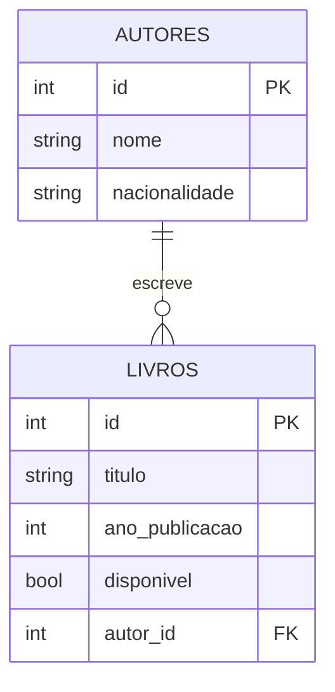

# 📚 API da Biblioteca

API REST para gerenciar o acervo de uma biblioteca: **autores** e os **livros** que escreveram.
Projeto prático desenvolvido com **FastAPI**, **SQLAlchemy** (ORM) e **Alembic** (migrações).

## Sumário

1. [Modelo de negócio](#modelo-de-negócio)
2. [Entidades e relacionamento](#entidades-e-relacionamento)
3. [Tecnologias](#tecnologias)
4. [Estrutura do projeto](#estrutura-do-projeto)
5. [Como executar](#como-executar)
6. [Endpoints](#endpoints)
7. [Regras de negócio e tratamento de erros](#regras-de-negócio-e-tratamento-de-erros)
8. [Exemplos de uso](#exemplos-de-uso)
9. [Integrantes](#integrantes)

## Modelo de negócio

Uma biblioteca precisa:

- cadastrar os **autores** do seu acervo;
- cadastrar **livros**, sempre vinculados a um autor;
- consultar o acervo e filtrar os livros **disponíveis** para empréstimo;
- manter os dados atualizados e remover registros quando necessário.

## Entidades e relacionamento



| Tabela | Campo | Tipo | Observações |
|---|---|---|---|
| `autores` | `id` | inteiro | chave primária |
| | `nome` | texto (até 100) | obrigatório |
| | `nacionalidade` | texto (até 50) | opcional |
| `livros` | `id` | inteiro | chave primária |
| | `titulo` | texto (até 150) | obrigatório |
| | `ano_publicacao` | inteiro | opcional (0 a 2100) |
| | `disponivel` | booleano | padrão `true` |
| | `autor_id` | inteiro | chave estrangeira → `autores.id`, obrigatório, indexada |

**Relacionamento 1:N:** um autor possui vários livros e cada livro pertence a um único autor.
No SQLAlchemy, a navegação é feita por `relationship()` nos dois lados: `Autor.livros` e `Livro.autor`.

## Tecnologias

- [FastAPI](https://fastapi.tiangolo.com/) — framework web e documentação Swagger automática
- [SQLAlchemy 2](https://docs.sqlalchemy.org/) — ORM
- [Alembic](https://alembic.sqlalchemy.org/) — migrações do banco
- [Pydantic](https://docs.pydantic.dev/) — validação e serialização
- SQLite — banco de dados (arquivo `biblioteca.db`)

## Estrutura do projeto

```
FastAPI/
├── alembic/
│   ├── versions/        # migrations versionadas
│   └── env.py
├── app/
│   ├── core/
│   │   └── database.py  # engine, sessão, Base e dependência `SessionDep`
│   ├── models/          # modelos SQLAlchemy (Autor, Livro)
│   ├── schemas/         # schemas Pydantic (Create / Update / Response)
│   ├── routers/         # endpoints agrupados por recurso
│   └── main.py          # criação do app e registro dos routers
├── alembic.ini
└── requirements.txt
```

## Como executar

**Pré-requisito:** Python 3.10 ou superior.

Todos os comandos abaixo devem ser executados dentro da pasta `FastAPI/`.

```bash
# 1. Criar e ativar o ambiente virtual
python3 -m venv .venv
source .venv/bin/activate          # Windows: .venv\Scripts\activate

# 2. Instalar as dependências
pip install -r requirements.txt

# 3. Criar o banco de dados por meio das migrações
alembic upgrade head

# 4. Iniciar a aplicação
uvicorn app.main:app --reload
```

A API ficará disponível em `http://127.0.0.1:8000` e a documentação interativa (Swagger) em
**http://127.0.0.1:8000/docs**.

> Em Debian/Ubuntu, se o passo 1 falhar, instale o pacote do venv: `sudo apt install python3-venv`.

### Migrações

O banco é criado **exclusivamente** via Alembic. Depois de alterar os modelos, gere e aplique uma nova migration:

```bash
alembic revision --autogenerate -m "descrição da mudança"
alembic upgrade head
```

Para desfazer a última migration: `alembic downgrade -1`.

## Endpoints

### Autores

| Método | Rota | Descrição | Respostas |
|---|---|---|---|
| `POST` | `/autores` | Cria um autor | 201, 422 |
| `GET` | `/autores` | Lista autores (paginação: `?skip=0&limit=100`) | 200 |
| `GET` | `/autores/{id}` | Busca um autor pelo id | 200, 404 |
| `GET` | `/autores/{id}/livros` | Lista os livros de um autor | 200, 404 |
| `PATCH` | `/autores/{id}` | Atualiza parcialmente um autor | 200, 404, 422 |
| `DELETE` | `/autores/{id}` | Remove um autor sem livros | 204, 404, 409 |

### Livros

| Método | Rota | Descrição | Respostas |
|---|---|---|---|
| `POST` | `/livros` | Cria um livro (valida se o autor existe) | 201, 404, 422 |
| `GET` | `/livros` | Lista livros (filtro `?disponivel=true\|false`, paginação `?skip=&limit=`) | 200 |
| `GET` | `/livros/{id}` | Busca um livro pelo id (inclui o autor) | 200, 404 |
| `PATCH` | `/livros/{id}` | Atualiza parcialmente um livro | 200, 404, 422 |
| `DELETE` | `/livros/{id}` | Remove um livro | 204, 404 |

## Regras de negócio e tratamento de erros

| Situação | Status |
|---|---|
| Recurso criado com sucesso | `201 Created` |
| Remoção realizada com sucesso | `204 No Content` |
| Autor ou livro não encontrado pelo id | `404 Not Found` |
| Criar/atualizar livro com `autor_id` inexistente | `404 Not Found` |
| Remover autor que ainda possui livros | `409 Conflict` |
| Dados inválidos (campo obrigatório ausente, tipo errado, fora dos limites) | `422 Unprocessable Entity` |

Os schemas Pydantic são separados por finalidade: `*Create` (entrada na criação), `*Update`
(todos os campos opcionais, usado no `PATCH`) e `*Response` (saída da API).

## Exemplos de uso

**Criar um autor**

```bash
curl -X POST http://127.0.0.1:8000/autores \
  -H "Content-Type: application/json" \
  -d '{"nome": "Machado de Assis", "nacionalidade": "Brasileira"}'
```

**Criar um livro para esse autor**

```bash
curl -X POST http://127.0.0.1:8000/livros \
  -H "Content-Type: application/json" \
  -d '{"titulo": "Dom Casmurro", "ano_publicacao": 1899, "autor_id": 1}'
```

Resposta (`201`):

```json
{
  "id": 1,
  "titulo": "Dom Casmurro",
  "ano_publicacao": 1899,
  "disponivel": true,
  "autor_id": 1,
  "autor": { "id": 1, "nome": "Machado de Assis", "nacionalidade": "Brasileira" }
}
```

**Marcar o livro como emprestado**

```bash
curl -X PATCH http://127.0.0.1:8000/livros/1 \
  -H "Content-Type: application/json" \
  -d '{"disponivel": false}'
```

**Listar apenas livros disponíveis**

```bash
curl "http://127.0.0.1:8000/livros?disponivel=true"
```

## Integrantes

| Nome | Matrícula |
|---|---|
| Guilherme Santos Gomes de Brito | 01795193 |
| Gustavo Pinto Fonseca | 01865514 |
| Kayk de Oliveira Silva | 01821798 |
| Thiago Pereira Sousa | 01791169 |
| Marcelo Iuri Soares Silveira | 01821799 |
