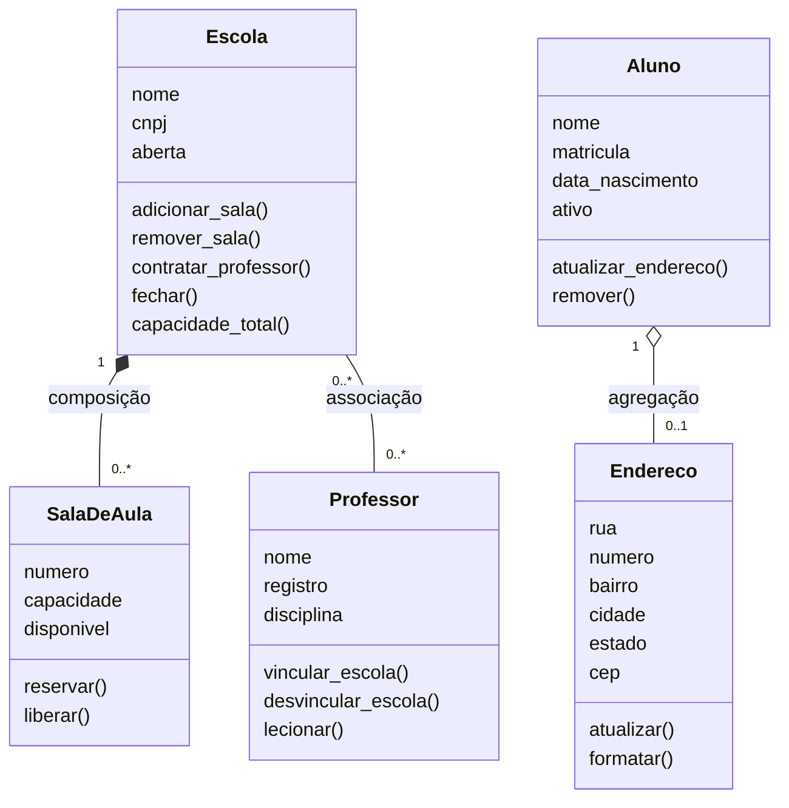
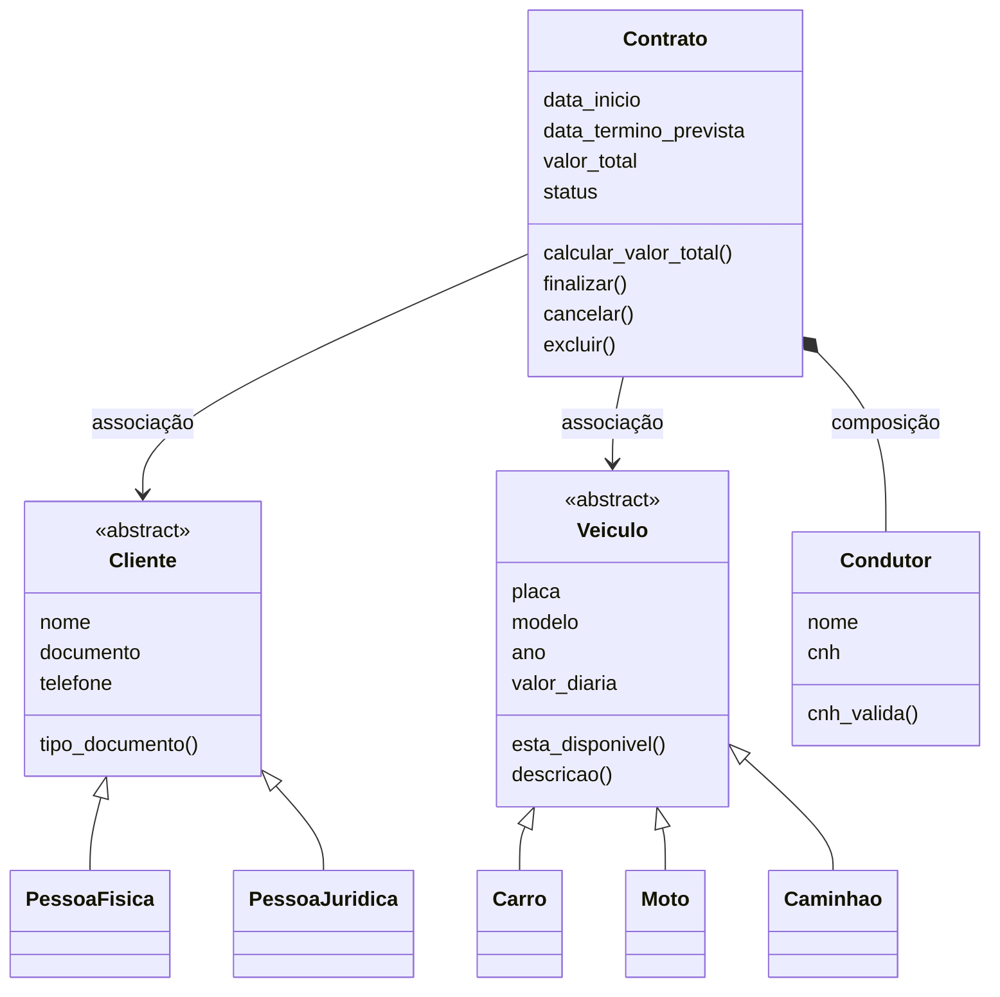
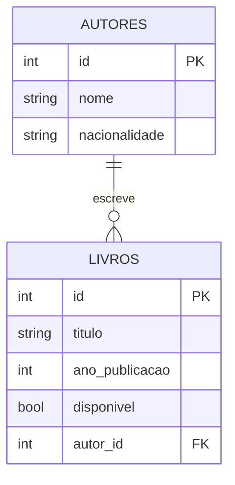

# Trabalhos Práticos — Arquitetura de Software

Repositório com os trabalhos práticos da disciplina **Arquitetura de Software**, do curso de Análise e Desenvolvimento de Sistemas (Bloco IV, 2026.2).

| Trabalho | Tema | Solução | Enunciado |
|---|---|---|---|
| 01 | Associação, agregação e composição em um sistema escolar | [P2_A1_POO.ipynb](P2_A1_POO.ipynb) | [PDF](Docs/Trabalho%20Pr%C3%A1tico%2001.pdf) |
| 02 | Herança e composição em uma locadora de veículos | [P2_A2_POO.ipynb](P2_A2_POO.ipynb) | [PDF](Docs/Trabalho%20Pr%C3%A1tico%2002.pdf) |
| 03 | API REST em camadas com FastAPI, SQLAlchemy e Alembic | [FastAPI/](FastAPI/) | [PDF](Docs/Trabalho%20Pr%C3%A1tico%2003.pdf) |

## Estrutura do repositório

```
.
├── Docs/                # enunciados dos três trabalhos (PDF)
├── FastAPI/             # Trabalho 03: API da Biblioteca
├── P2_A1_POO.ipynb      # Trabalho 01: sistema escolar
└── P2_A2_POO.ipynb      # Trabalho 02: locadora de veículos
```

## Trabalho 01 — Sistema escolar

Modela as cinco entidades do cenário (`Escola`, `SalaDeAula`, `Professor`, `Aluno` e `Endereco`) e os três tipos de relacionamento entre elas.



| Relação | Tipo | Justificativa |
|---|---|---|
| `Escola` → `SalaDeAula` | Composição | A sala só é criada por `Escola.adicionar_sala()` e deixa de existir quando a escola fecha. |
| `Escola` ↔ `Professor` | Associação (N:N) | Os dois existem de forma independente. Ao fechar uma escola, o professor continua existindo e mantém o vínculo com as demais. |
| `Aluno` → `Endereco` | Agregação | O endereço nasce com o aluno, mas `Aluno.remover()` devolve o endereço, que segue existindo para uso em outro contexto (por exemplo, relatórios). |

## Trabalho 02 — Locadora de veículos

Estudo de caso de uma locadora, com duas hierarquias de herança e a composição entre contrato e condutor.



Regras implementadas:

- um veículo não pode ter dois contratos ativos ao mesmo tempo;
- a data de término não pode ser anterior à data de início;
- o valor total é o número de dias multiplicado pela diária, com mínimo de uma diária;
- finalizar ou cancelar um contrato libera o veículo;
- o condutor é criado pelo contrato e deixa de existir quando o contrato é excluído.

### Como executar os notebooks

Os dois notebooks usam apenas a biblioteca padrão do Python. Abra o arquivo no Jupyter, no VS Code ou no Google Colab e execute a célula: a função `main()` monta um cenário de exemplo e imprime o resultado de cada regra.

## Trabalho 03 — API da Biblioteca

API REST para gerenciar o acervo de uma biblioteca: **autores** e os **livros** que escreveram. A biblioteca cadastra autores, cadastra livros sempre vinculados a um autor, consulta o acervo e filtra os livros disponíveis para empréstimo.

A documentação completa, com regras de negócio e exemplos de requisição, está em [FastAPI/README.md](FastAPI/README.md).

### Entidades e relacionamento



Relacionamento **1:N**: um autor possui vários livros e cada livro pertence a um único autor. A navegação é feita com `relationship()` nos dois lados (`Autor.livros` e `Livro.autor`).

### Como executar

Pré-requisito: Python 3.10 ou superior.

```bash
cd FastAPI

# 1. Criar e ativar o ambiente virtual
python -m venv .venv
.venv\Scripts\activate             # Linux/macOS: source .venv/bin/activate

# 2. Instalar as dependências
pip install -r requirements.txt

# 3. Criar o banco de dados pelas migrações
alembic upgrade head

# 4. Iniciar a aplicação
uvicorn app.main:app --reload
```

Com a aplicação rodando:

- Interface web do acervo: http://127.0.0.1:8000
- Documentação interativa (Swagger): http://127.0.0.1:8000/docs

O banco SQLite (`biblioteca.db`) é criado exclusivamente pelo Alembic.

### Endpoints

| Método | Rota | Descrição |
|---|---|---|
| `POST` | `/autores` | Cria um autor |
| `GET` | `/autores` | Lista autores (`?skip=&limit=`) |
| `GET` | `/autores/{id}` | Busca um autor pelo id |
| `GET` | `/autores/{id}/livros` | Lista os livros de um autor |
| `PATCH` | `/autores/{id}` | Atualiza parcialmente um autor |
| `DELETE` | `/autores/{id}` | Remove um autor que não possui livros |
| `POST` | `/livros` | Cria um livro (valida se o autor existe) |
| `GET` | `/livros` | Lista livros (`?disponivel=true\|false`, `?skip=&limit=`) |
| `GET` | `/livros/{id}` | Busca um livro pelo id, incluindo o autor |
| `PATCH` | `/livros/{id}` | Atualiza parcialmente um livro |
| `DELETE` | `/livros/{id}` | Remove um livro |

Códigos de erro: `404` para autor ou livro inexistente, `409` ao remover um autor que ainda possui livros e `422` para dados inválidos.

## Integrantes

| Nome | Matrícula |
|---|---|
| Guilherme Santos Gomes de Brito | 01795193 |
| Gustavo Pinto Fonseca | 01865514 |
| Kayk de Oliveira Silva | 01821798 |
| Thiago Pereira Sousa | 01791169 |
| Marcelo Iuri Soares Silveira | 01821799 |
